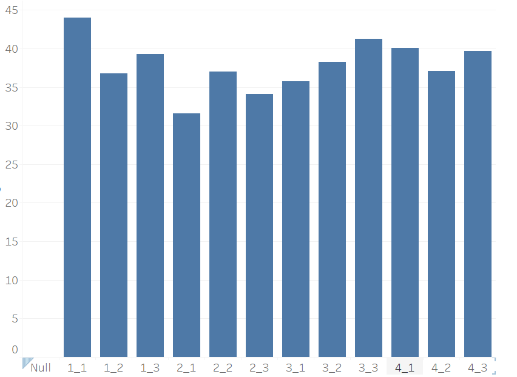
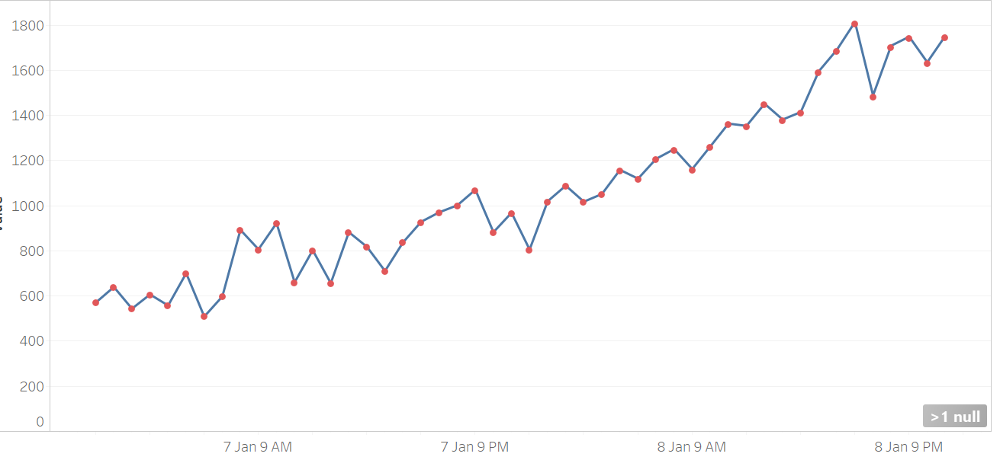
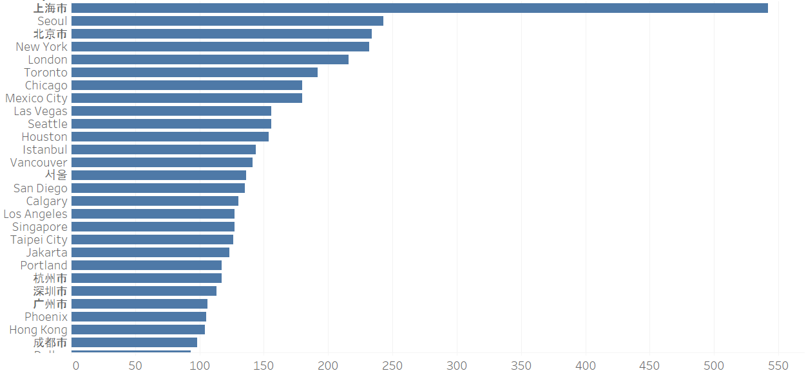
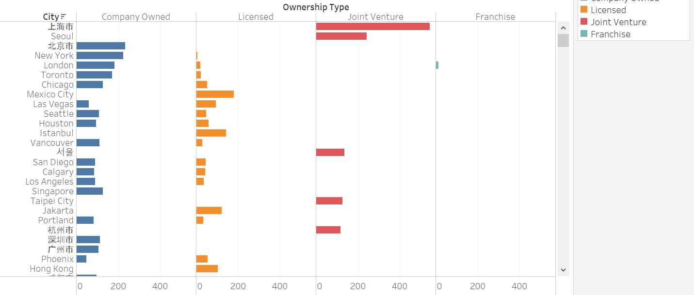
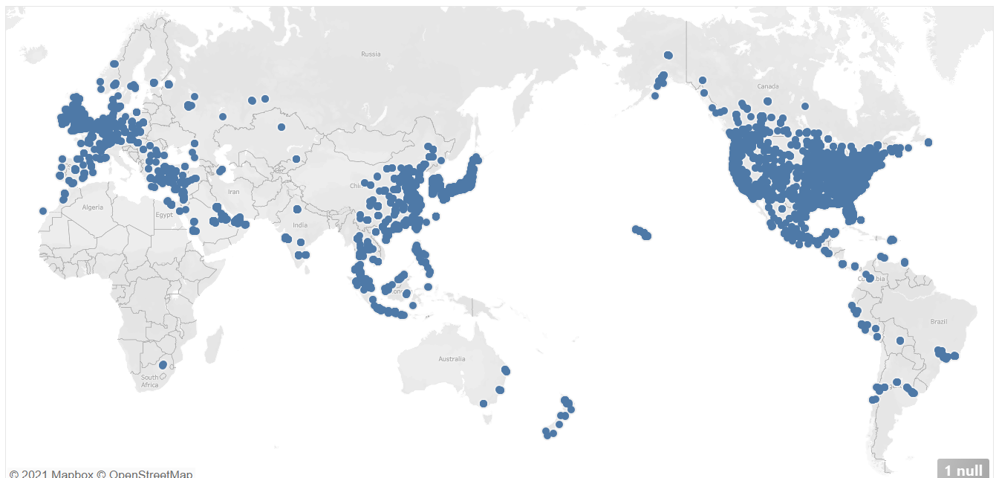
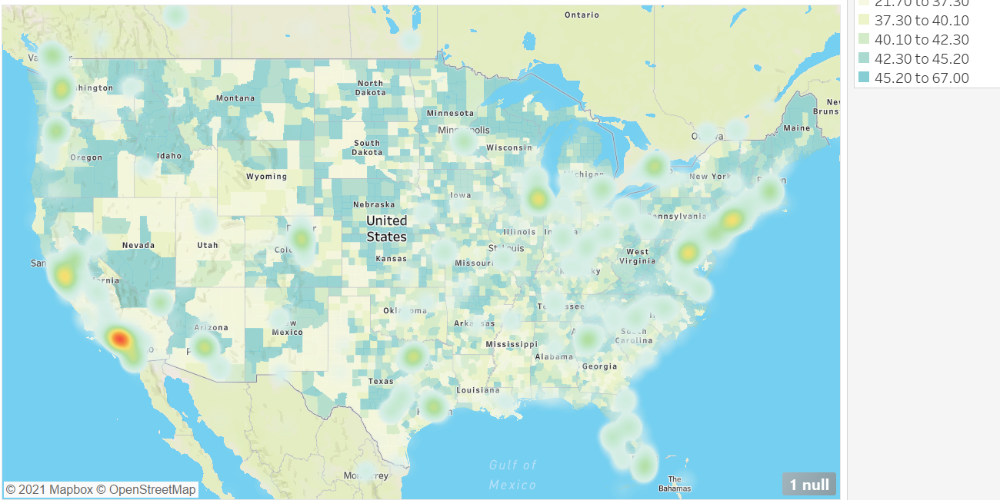

# DATA 301 Lab 6 - Visualization with Tableau

## Instructions

For this lab, the instructions are in this README file.
This lab uses Tableau to visualize, analyze, and explore data sets. **This lab should be done individually.**

## Useful Resource:
- [Google slides for presentation](https://docs.google.com/presentation/d/1rTyl5_-MAjgimppsRoRSwzDqFY7bZsA4xO-Q4H6omZw/edit?ts=5ecc2dd0#slide=id.p1)

## Objectives

1.  Explore the capabilities of Tableau for importing, formatting, and visualizing data sets.
1.  Visualize data from an Excel spreadsheet.
1.  Apply filtering, sorting, and aggregation in visualizations.
1.  Create a dashboard consisting of multiple related visualizations.

## Installing Tableau

[Download Tableau](https://www.tableau.com/tft/activation).

- Download the latest version of Tableau Desktop (you do not need Tableau Prep Builder).
- Click on the link above and select “Download Tableau Desktop”. On the form, enter your school email address for Business E-mail and enter the name of your school for Organization.
- Activate with your product key: `TC85-EEC6-AD00-9155-BC10` 
- If you already have a copy of Tableau Desktop installed: update your license in the application: Help menu → Manage Product Keys

## Sensor data set (8 marks)
The first data set we will be using is one you have seen before, the sensor data from lab 1. This will help show you how much easier it is to create graphs in tableau compared to excel! 

### 1. Load the data (2 marks)

We have provided you with a file called Sensor_Data.csv located in the data folder. 

#### Instructions

1. On the left-hand side in the blue bar, you'll see a "Connect" heading. This is where you can connect Tableau to your data.      
1. Since we are using a `.csv` file we are going to click on "**More...**" under the "**To a File**" subheading.           
 _💡You can connect to many different things such as Microsoft SQL, PostgresSQL, Google Sheets, MongoDB BI Connector, etc. This is all accessible in "**More...**" under the sub-heading "**To a Server**"._
1. Locate the data and click "**Open**". This should connect your data and you  should see a table. (You may need to click the "**Update Now**" button at the bottom)
1. You can choose to rename your data source by clicking the title at the top.
1. To start creating plots you can click "**Sheet 1**" at the bottom left of the window. 

### 2.Create the following graphs: (6 marks)

For each graph, make a new sheet. Rename each sheet according to the question number. Also, make sure you change the x-axis, y-axis, and title for each graph. 

#### 2a. Create a Bar Chart for the average value for each global sensor id. (2 marks)

note: make sure you use the average value, not the sum!

#### Sample output: 

#### 2b. Create a graph showing the sensor data over time (with an x-axis of hours). (4 marks)

For this graph, we want to do something a little different. If we plotted a line graph, we would get a continuous line. If we plotted a scatter plot, we would only get circles for each data point. What if we wanted to do both? 

<u>Instructions:</u> 
Start by creating a line graph plotting the sum of the values vs. the timestamp in hours.

Next, we can combine this with a scatterplot by adding an identical 'sum of values' to Rows. At first, you should get 2 graphs on top of each other. However, right click one of the pills in rows and select **Dual Axis**

This will superimpose one on another with a left and a right axis title. We can hide the one on the right by right-clicking the axis and unticking the "**Show Header**" option. 

In the marks section, make sure one of the SUM(Values) is set to line, and the other is set to circle. While you do this, also change the color of the circles to red. 

#### Sample output:

## Starbucks Data Set (12 marks)

### 3. Load the data (2 marks)

We have provided you with a file called Starbucks.csv (from Kaggle). Add this as a new data source. 

### 4. Create the following graphs: (10 marks)

For each graph, make a new sheet. Rename each sheet according to the question number. Also, make sure you change the x-axis, y-axis, and title for each graph. 

#### 4a. Bar graph showing the count of Starbucks locations per City. (2 marks)

Sort this graph in descending order (according to the count of Starbucks locations)

#### Sample Output: 

#### 4b. Copy your work from 4a. This time, instead of only seeing the count of starbucks locations per City, we also want to see the Ownership types for these locations. (2 marks)

Sort this graph in descending order (according to the count of Starbucks locations)

Change the colors, making each ownership type a different color. 

#### Sample Output:

#### 4c. Maps! (2 marks) 

One cool thing you can do is Tableau is create interesting maps. In order to do this, move the Longitude to columns and Latitude to rows. Make sure they are both dimensions. This should result in a map with dots indicating all the Starbucks locations.

#### Sample Output:

#### 4d. Formatting maps. (4 marks) 

Copy your work from 4c into a new sheet. Now we will be looking at a couple of cool features you can use for maps. *Note that the visualization generated in this exercise is not one that we would recommend to present data, but it serves its purpose to highlight some Tableau's features*.

First of all, click **Map** in the top toolbar, and select **Map Layers**.

1) Change the style to "outdoors" 
2) Change the graph type to density 
3) Add a data layer (this is data that is included in Tableau, unfortunately, the data is only provided for the United States, so, for this graph, lets zoom into the United States). The data layer you are adding is "Age (median)" by "County"

Now that you are done, you can see the map showing the density of Starbucks locations, as well as a visualization of the median age for the locations. The map tool in Tableau is very useful, and the possibilities are endless. 

#### Sample Output:
You should have something that looks like this (when zooming into the United States). 

## Putting it all Together in a Dashboard (6 marks)

You can take an arbitrary number of plots in sheets and lay them out in a "Dashboard". This part of the lab guides you on how to do this.

### Making a Dashboard:

1. Create a new dashboard by clicking "**Dashboard**" in the top menu bar and selecting "**New Dashboard**"
2. Before you do anything else, under the "**Size**" heading, click the triangle beside "Desktop Browser (1000x800)". Change "**Fixed Size**" to "**Automatic**". This will now make sure your dashboard adjusts to all monitor sizes. 
3. Let drag our sheets in using Tiled objects. Under "**Sheets**" on the left-hand side, drag and drop the sheets you want to include in your dashboard. 

### Requirements: (what you are being graded against)

You can include any of the previous graphs in your dashboard (or experiment with new ones). Your final dashboard has to have at least 2 filters, and 3 graphs being demonstrated. 

### Information about filters: 

1. Decide which filters you want for each plot. 
2. Go to the sheet by navigating to the bottom and selected the worksheet of interest.
3. Under "**Tables**" Drag the column you wish to filter.
4. Repeat this step for each of your worksheets. (OR wait and follow the next section) 
5. To obtain filters, on the side of the dashboard you will see a ▼ icon. Click this  and under "**Filter**" Select one of the column names. 
6. We can edit the filter style by clicking the "**More Options**" ▼ icon and changing the style. 
    - If it's filtering categorical data there are options like "**Single value (list)**", "**Single value (dropdown)**", "**Single value (slider)**", "**Multiple value (dropdown)**", etc. 
7. You can "**Customize**" The filter styles to include certain features as well. 

#### One Filter For Multiple Graphs
- If you want to use a single filter for multiple plots, you can do so using the "**Apply to Worksheet**" option. 
- This gives you the ability to select which sheet to also be filtered on this column or you can apply to "**All Using This Data Source**". 

#### Using a Graph as a Filter

If you want to use a highlight something on a plot and have it act as a filter on other sheets in the dashboard, this can be done with a single mouse click. 
- Simply find the funnel icon on the side. When you hover over it, it should say "**Use Sheet as Filter**". 

## Submission

Include the Tableau Workbook file (.twb), and a screenshot of your final dashboard called "final_dashboard.png" in this GitHub repository and you're done!

## Attribution
This lab was inspired from previous labs from Dr. Moosvi and Dr. Fazackerley. Thank you to Haneen Abu-Hijleh for this new lab.

